# Designer Platform Architecture

This guide explains the platform's architecture, technology choices, ownership boundaries, and principal workflows. It is intended as a visual introduction for engineers, reviewers, and operators. For detailed routes and business rules, see [Application Logic](APPLICATION_LOGIC.md).

## 1. Platform at a glance

Designer Platform is a multi-tenant SaaS monorepo. A shared control plane manages identity, organisations, permissions, product licensing, and sessions. Independently deployable product services own their domain data.

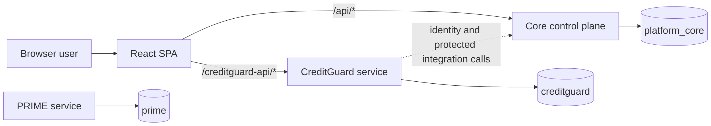

The central design rule is **control-plane data stays in core; product-domain data stays in the owning product service**. There are no cross-database foreign keys or distributed transactions.

## 2. Technology stack

| Layer | Technology | Purpose |
| --- | --- | --- |
| Workspace | npm workspaces, Node.js 20+ | Monorepo dependency and script management |
| Web client | React 18, TypeScript, Vite 5 | Single-page application and development proxy |
| Navigation | React Router 6 | Public, workspace, product, organisation, and admin routes |
| Server state | TanStack Query 5 | Query lifecycle and cache infrastructure |
| Styling | Tailwind CSS 3, PostCSS | Responsive UI styling |
| Icons | Lucide React | Consistent accessible interface icons |
| Authentication client | MSAL Browser/React | Azure AD B2C redirect and token acquisition |
| APIs | NestJS 10, TypeScript | Core and product HTTP services |
| Validation | class-validator, class-transformer | Core DTO validation and transformation |
| Persistence | PostgreSQL 16, Drizzle ORM | Isolated relational stores and migrations |
| Local authentication | bcryptjs, JSON Web Tokens | Password hashing and platform-issued sessions |
| Email | Nodemailer | Review notifications and auditable delivery attempts |
| Documents | Local filesystem or Azure Blob Storage | Private CreditGuard attachment content |
| Browser testing | Playwright | Deterministic end-to-end route and workflow tests |
| Cloud definition | Azure Bicep | Container Apps, PostgreSQL, Key Vault, and logging scaffold |

## 3. Monorepo design

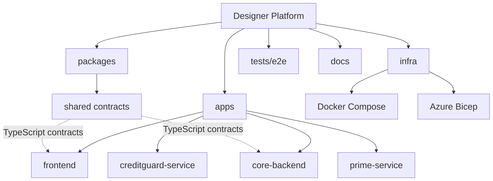

| Workspace | Responsibility |
| --- | --- |
| `apps/frontend` | One responsive SPA for platform and product experiences |
| `apps/core-backend` | Identity, tenancy, RBAC, menus, products, projects, settings, licensing, sessions, email, and encrypted integration configuration |
| `apps/creditguard-service` | Financial-security requests, attachments, reviewer state, approvers, Signit envelope references, and reports data |
| `apps/prime-service` | PRIME service/database scaffold; domain behavior is not yet defined |
| `packages/shared` | Shared TypeScript API contracts and role constants |
| `infra` | Local PostgreSQL and intended Azure infrastructure |
| `tests/e2e` | Playwright tests with deterministic browser-level API mocks |

## 4. Runtime topology

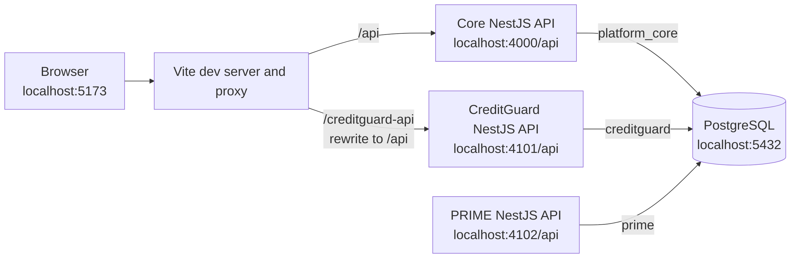

The browser uses relative URLs. In development, Vite routes core traffic and rewrites CreditGuard traffic. Product services are separate runtimes even when they share one local PostgreSQL server.

| Runtime | Port | Public prefix | Database |
| --- | ---: | --- | --- |
| Frontend | 5173 | `/` | None |
| Core backend | 4000 | `/api` | `platform_core` |
| CreditGuard | 4101 | `/api` | `creditguard` |
| PRIME | 4102 | `/api` | `prime` |

## 5. Frontend design

The provider order is an application invariant because later providers consume earlier context:

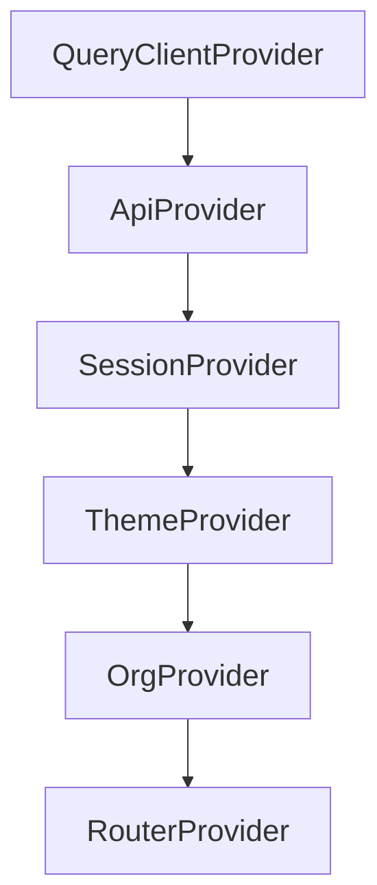

- `ApiProvider` owns authenticated core and CreditGuard request helpers.
- `SessionProvider` owns the local user, JWT lifecycle, and sign-out behavior.
- `ThemeProvider` loads shared and personal appearance settings.
- `OrgProvider` owns the active tenant selection.
- `RouterProvider` renders routes after all required state is available.

Navigation is data-driven. Core returns the current user's menu tree, while React Router supplies route boundaries. Menu visibility improves usability but is not an authorization control; APIs must independently enforce access.

## 6. Identity, tenancy, and authorization

The SPA supports local credentials and Azure AD B2C. Local JWTs take precedence when both mechanisms are available.

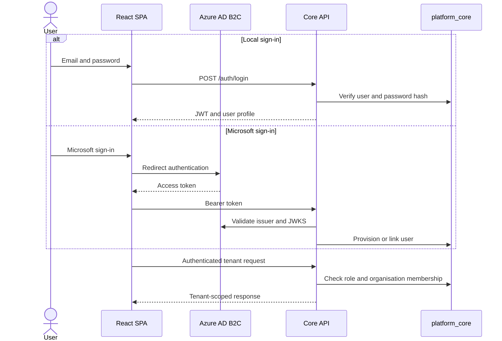

Authorization has several dimensions:

| Control | Meaning |
| --- | --- |
| Global role | Platform-wide authority such as `Global Administrator` |
| Organisation membership | Tenant authority: `Owner`, `Admin`, or `Member` |
| Product role | Module behavior such as `CreditGuard Requestor` or `CreditGuard Reviewer` |
| Menu grant | Route visibility and optional `readonly`/`editable` presentation |
| Module allocation | Whether an organisation is licensed for a product |
| Project allocation | Whether project-scoped product access is available |
| Session lease | Whether a concurrent product/admin seat is currently held |

Every tenant-sensitive query must authorize the supplied organisation identifier. UI hiding alone is never the security boundary.

## 7. Data ownership

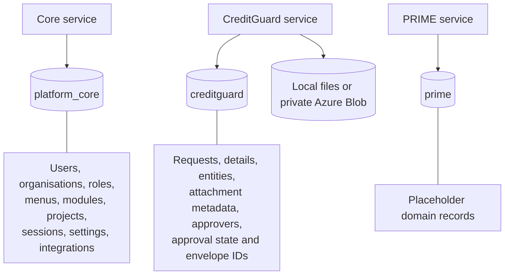

Cross-service actions are coordinated application workflows, not atomic distributed transactions. Each service must fail explicitly and preserve recoverable state when a downstream operation fails.

## 8. CreditGuard request lifecycle

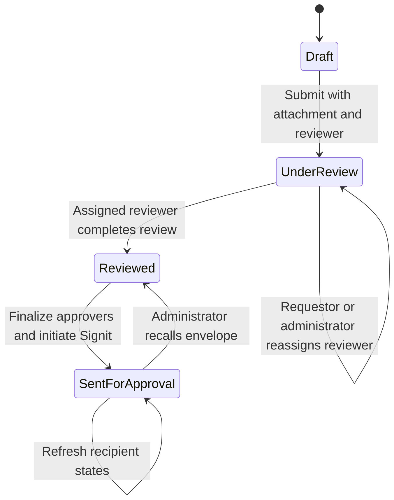

The API owns these workflow transitions. While attachments are editable, **Attach Request** creates a new McDermott-branded PDF from request and business details, excluding approval and approver fields, and atomically inserts or replaces its attachment metadata. Before review completion, the requestor or an administrator may reassign the reviewer without unlocking request fields; the former reviewer receives a pullback email and the replacement receives the standard review notification. Review completion is a separate status/audit transition and does not generate a document. Forms become progressively more restricted as the request advances, and sent requests are immutable through ordinary edit, attachment, and approver endpoints. Refresh updates approver records but deliberately leaves the request at `Sent for Approval`.

## 9. Signit approval architecture

Signit credentials are tenant/product configuration owned by core. They are encrypted at rest with AES-256-GCM and never returned to the browser or CreditGuard service.

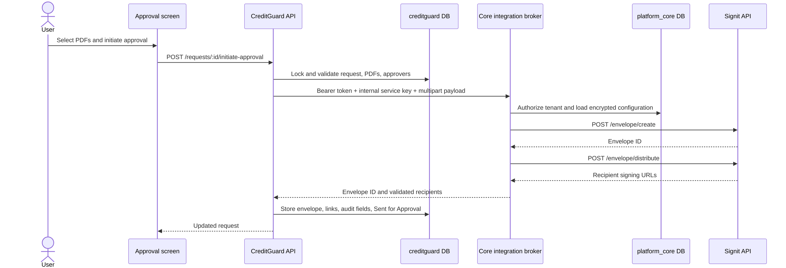

The create payload uses sequential signing:

```json
{
  "type": "DOCUMENT",
  "title": "<instrument type> - <beneficiary>",
  "externalId": "<CreditGuard request ID>",
  "recipients": [
    {
      "email": "approver@example.com",
      "name": "Approver Name",
      "role": "APPROVER",
      "signingOrder": 1
    }
  ],
  "meta": {
    "signingOrder": "SEQUENTIAL"
  }
}
```

Status refresh and recall use the same broker boundary:

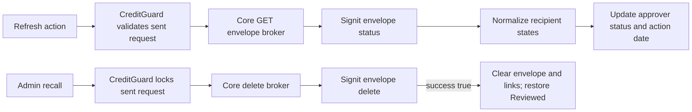

Both the user's bearer token and a shared `CREDITGUARD_INTERNAL_API_KEY` protect broker calls. Recipient emails are matched exactly before signing links or statuses are persisted.

## 10. Document storage

CreditGuard separates attachment metadata from binary content:

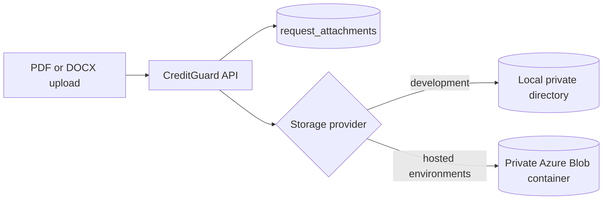

Uploads are validated for type, size, count, request ownership, organisation scope, and workflow mutability. Blob access should use managed identity where available.

## 11. Licensing and sessions

Product access requires an active organisation module allocation and a licensed session. Project-scoped products also require a project allocation.

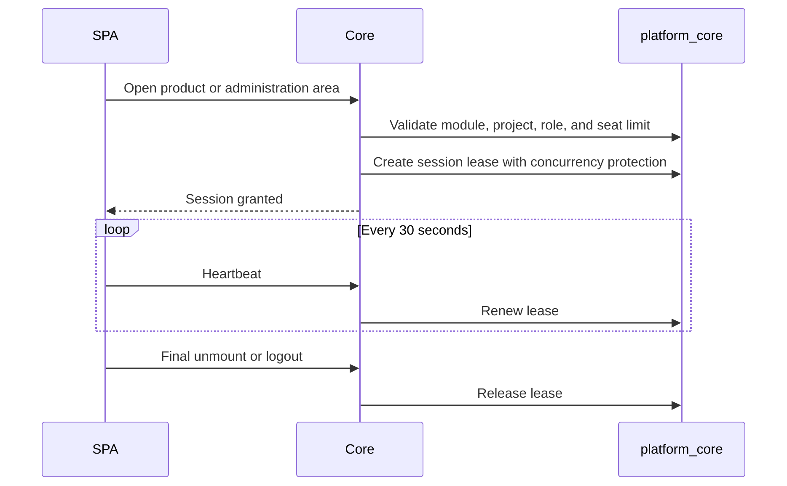

Seat enforcement and lease cleanup are concurrency-sensitive controls. Failures must remain visible rather than being converted to successful UI state.

## 12. Deployment architecture

Local development uses one PostgreSQL 16 container with three databases. The Azure Bicep template describes the intended service topology:

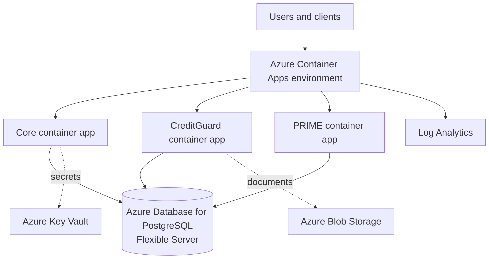

The current Bicep file is a scaffold: its Container Apps use a Microsoft hello-world placeholder image and expose each service externally. Production deployment requires approved application images, private service trust boundaries, managed identities, secret bindings, network controls, TLS, monitoring, backup, and cost/security review.

## 13. Testing strategy

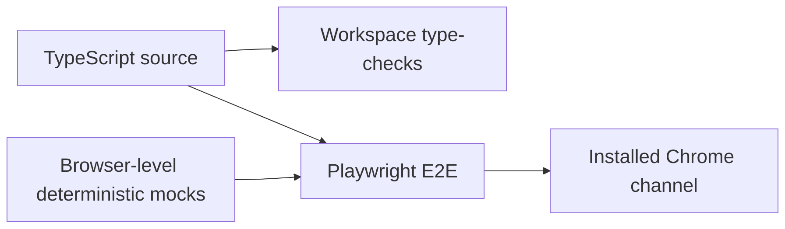

- Workspace type-checks catch contracts within frontend and services.
- Playwright exercises routes, forms, state, network payloads, success paths, and relevant failures.
- Standard E2E tests mock API traffic and do not require PostgreSQL, B2C, Signit, SMTP, or Azure.
- Database migrations and real integrations require separate disposable-environment validation.

## 14. Security boundaries

| Boundary | Control |
| --- | --- |
| Browser to APIs | Bearer authentication; route and DTO validation |
| User to tenant | Active organisation membership and role checks |
| User to product | Module allocation, product role, optional project allocation, session lease |
| CreditGuard to core broker | User bearer token plus shared internal service key |
| Core to Signit | Decrypted tenant credential applied immediately before outbound request |
| Application to database | Separate database ownership per service |
| CreditGuard to documents | Private provider abstraction; no public container assumption |
| Secret storage | Environment/approved secret store; encrypted integration values at rest |

Important constraints:

- Do not expose product services directly without hardening their independent authentication boundary.
- Do not move CreditGuard domain records into `platform_core`.
- Do not trust client-provided organisation, project, product, ownership, role, or workflow fields.
- Do not log tokens, passwords, integration keys, connection strings, or confidential documents.
- Do not assume atomicity across core, CreditGuard, Signit, email, and document storage.

## 15. Design rationale

| Decision | Benefit | Trade-off |
| --- | --- | --- |
| Shared control plane | One source for identity, tenancy, licensing, and navigation | Product workflows depend on core availability |
| Database per product | Strong ownership and reduced accidental coupling | Cross-service workflows need explicit recovery |
| One SPA | Consistent navigation and session experience | Frontend must respect multiple API/error contracts |
| Core integration broker | Browser and product service never receive Signit credentials | Core handles an additional protected integration surface |
| Drizzle migrations | Typed schema and inspectable SQL | Deployment ordering must be managed explicitly |
| Deterministic E2E mocks | Fast and repeatable workflow tests | Real service integration needs an additional test layer |

## 16. Where to look next

| Need | Source |
| --- | --- |
| Setup and commands | [README](../README.md) |
| Routes and business behavior | [Application Logic](APPLICATION_LOGIC.md) |
| Agent security and change policy | [Agent Guidelines](../AGENTS.md) |
| Frontend implementation | `apps/frontend/src` |
| Core implementation | `apps/core-backend/src` |
| CreditGuard implementation | `apps/creditguard-service/src` |
| Shared contracts | `packages/shared/src` |
| Local/cloud infrastructure | `infra` |
